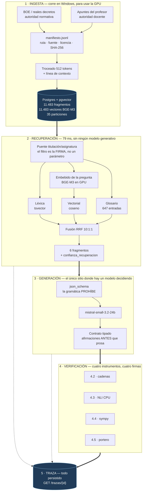

# Veridica

Un profesor por asignatura sobre temario real que **solo afirma lo que puede sostener**: cita
literal comprobada carácter a carácter, paráfrasis verificada contra el fragmento fuente, cálculo
recalculado, y silencio honesto cuando la respuesta no está en el material.

**Lo que hace que casi nadie hace: no confía en el modelo para decidir si el modelo dice la verdad.**
Un sistema de recuperación normal te devuelve una respuesta con enlaces. Este devuelve una respuesta
donde **cada afirmación lleva un veredicto emitido por un instrumento distinto del que la produjo**,
y el veredicto viaja firmado con el nombre de ese instrumento.

**Y el número que es logro, no diagnóstico: el 100 % de las citas mal declaradas se cazan, por
construcción.** No es "es poco probable que mienta" ni "el prompt le pide que no mienta": **no
puede**, porque quien lo decide es una comparación de cadenas **sin ningún modelo en el lazo**. Lo
que no cuadra se degrada a paráfrasis y se verifica como tal, o se marca.
([evidencia](docs/evidencia/2026-08-13-verificador-literal.md))

> **Estado.** Este README es el documento de entrada. El estado real, encargo por encargo y derivado
> del código, está en **[docs/ESTADO.md](docs/ESTADO.md)**.

---

## Una consulta, medida donde ocurre

Esto no es un mapa de cajas: es **qué pasa y cuándo**. Todos los milisegundos salen de las marcas
que la propia API persiste en `etapas.marcas`, **p50 sobre 150 respuestas reales** de la
configuración que corre hoy (fusión 10:1:1, pool 30, sin reordenador, NLI enchufado), entre el
**14/08/2026 14:11 y el 15/08/2026 02:12**.

```mermaid
gantt
    title Línea de tiempo de una consulta (p50, n=150, 14-15 ago 2026)
    dateFormat x
    axisFormat %S s
    section Recuperar · nuestro, sin modelo
    Recibir y embeber la pregunta (GPU)    :done, emb, 0, 24
    Búsqueda léxica                        :done, lex, 24, 48
    Búsqueda vectorial                     :done, vec, 48, 78
    Fusión RRF 10:1:1                      :done, fus, 78, 93
    SEIS FRAGMENTOS EN PANTALLA            :crit, frg, 93, 123
    Petición al proveedor                  :done, env, 123, 125
    section Generar · el proveedor
    Prefill y cola                         :active, pre, 125, 421
    Afirmaciones (el alumno NO las lee)    :active, afi, 421, 2166
    Prosa (esto sí lo lee)                 :active, pro, 2166, 2858
    section Verificar · nuestro, DENTRO de la banda de arriba
    Cita literal · comparación de cadenas  :crit, v1, 2166, 2858
    Paráfrasis · NLI en CPU, 2 hilos       :crit, v2, 2166, 2858
    Cálculo · sympy                        :crit, v3, 2166, 2858
    Portero · frase a frase mientras sale  :crit, v4, 2166, 2858
```

**Lo que hay que ver sin leer nada: la banda de verificación cae DENTRO de la de generación.** No
es un dibujo bonito, es el mecanismo. El contrato obliga al modelo a escribir las **afirmaciones
antes** que la prosa, así que en el instante en que aparece el primer carácter que el alumno lee, el
array de afirmaciones **ya está cerrado** dentro del JSON parcial
([`afirmaciones_en_curso.py`](app/core/afirmaciones_en_curso.py)). Los verificadores arrancan ahí, en
dos hilos aparte —torch suelta el GIL, así que el bucle sigue leyendo—, y los veredictos salen por el
flujo con `durante_la_redaccion: true` mientras la prosa sigue llegando.

**Por eso verificar no cuesta tiempo de pared, y ese es el dato que más convence de todo el repo.**
Medido con **una sola variable cambiada** (cuatro lotes de 20 consultas, la misma hora, 14/08):
encender el NLI cuesta **~130 ms de p50 y CERO cortes** adicionales
([evidencia](docs/evidencia/2026-08-14-nli-enchufado.md)). Un par de NLI son **59,6 ms en CPU**
(corrida 45, 14/08) y una respuesta trae 1-2; la ventana en la que caben son los **704 ms de prosa**
(p50 del tramo, misma población) que el modelo todavía está escribiendo. **De ahí que el NLI vaya en
CPU y no en GPU: es una decisión, no una limitación** — la GPU es del embebedor, y meter un tercer
modelo allí bajaría el techo de concurrencia a cambio de nada.

**Y el otro efecto, medido en la misma tabla: el alumno ve las citas a los 123 ms y la primera
palabra de prosa a los 2.166.** Diecisiete veces antes. La pantalla no está esperando: está
enseñando de dónde va a salir la respuesta.

| Punta a punta, misma población (n=150) | Filas | Casos distintos |
|---|---:|---:|
| n | 150 | **71** (×2,11) |
| p50 | **2.915 ms** | 2.973 ms |
| p95 | 7.733 ms | 7.117 ms |
| Máximo | 8.030 ms (ahí corta el plazo) | 8.017 ms |
| Pasan del objetivo de producto (5 s) | **18 de 150 · 12,0 %** | 7 de 71 · 9,9 % |
| Abstenciones, todas por plazo | 10 de 150 · 6,7 % | 6 de 71 · 8,5 % |

Las dos unidades, porque el titular alimenta una decisión
([evidencia](docs/evidencia/2026-08-15-latencia-sin-reordenador.md), donde está también la
comprobación de que **la cifra publicada se reproduce dígito a dígito** antes de recomputarla).
**Aquí deduplicar MEJORA el número** —12,0 % → 9,9 %—, al revés que en el titular de las citas: allí
se repetían los casos fáciles, aquí se repiten las preguntas lentas. Se publica la de filas, que es
la que ya estaba publicada y la que reproduce.

**Esa fila corrige a mejor un suspenso publicado, y conviene decirlo con el antes al lado:** con el
reordenador puesto (13/08) el p50 era **5.151 ms** y *"entre el 30 y el 40 % de las consultas no
caben en 5 segundos"*. Hoy el p50 cabe y el incumplimiento es del 12,0 % **sobre esa población** — y
la evidencia vieja lleva escrito arriba que quedó superada, en vez de quedarse afirmando en presente
un estado que ya no existe.

**Y la mitad del número es de qué está hecho, así que va medido y no advertido:** de esas 150,
**150 llevan asignatura elegida a mano** —el camino que corre desde el 15/08 **no la lleva**—,
**24 son del modo `acompanar`**, cuyo p50 es 1.069 ms más bajo porque son andamiajes cortos, y las
preguntas se repiten **×2,11**. Es tráfico mezclado: tests, scripts de medida y consultas a mano.

### Y LA RE-MEDIDA CONTROLADA YA ESTÁ HECHA, Y NO BORRA EL SUSPENSO: LO CONFIRMA

Las 150 de arriba son **tráfico mezclado** —tests, scripts de medida, consultas a mano, muchas con
asignatura elegida—. El lote controlado son **veinte preguntas ordinarias de DWES por el camino que
corre el lunes**: titulación elegida, **sin** asignatura y **sin** modo pedido, corrido **dos veces**
([evidencia](docs/evidencia/2026-08-15-veinte-preguntas-ordinarias-de-dwes.md)):

| n=20, dos corridas | |
|---|---:|
| p50 | 4.024 y **3.498 ms** |
| p95 | 8.010 y 8.022 ms |
| **Pasan del objetivo de 5 s** | **7 de 20 · 35 %** — *en las dos corridas* |
| Cortadas a los 8 s, sin una letra en pantalla | 2 y 4 de 20 |

**La mediana cumple el objetivo; la cola no.** Las dos cifras son verdad sobre su población y **no se
comparan entre sí**: 12,0 % y 35 % salen de dos muestras distintas, y el 35 % es el que describe lo
que va a ver quien escriba su propia pregunta. **Que las preguntas cortadas sean DISTINTAS en cada
corrida** dice además que el corte es varianza del proveedor, no una propiedad de la pregunta: con
n=20 y una tasa del 10-20 %, dos corridas no distinguen 2 de 4.

---

# LO QUE ENCONTRAMOS

Cada número con su **unidad**, porque el arnés repite las mismas preguntas (×4,84 en consultas) y
contar filas en vez de casos distintos infla todos los agregados. Los dos recuentos, y nunca uno
solo, en el [barrido de filas contra casos](docs/evidencia/2026-08-14-barrido-filas-vs-casos.md).

### 1. Solo el **50,9 %** de lo que el modelo llama «cita literal» lo es

**57 de 112 citas distintas** (por filas: 195 de 337 = 57,9 %). Casi la mitad de lo que sale
etiquetado como cita textual **no aparece literalmente en su fragmento**.

**Este número mide al GENERADOR, no a nosotros.** No es una tasa de alucinación: muchas serán
paráfrasis correctas mal etiquetadas. **El daño no es que sea inventado: es que llega etiquetado como
cita.** Un alumno que copie eso en un examen creyendo que son las palabras del libro se equivoca
*precisamente por haberse fiado*.

**Y el 57,9 % y el 50,9 % son el mismo hecho contado de dos maneras, con siete puntos de diferencia
a favor del sistema en la versión cómoda.** Las citas cortas y fáciles son las que más se repiten, y
la repetición maquilla. Por eso [`app/core/conteo.py`](app/core/conteo.py) devuelve **siempre** las
dos cifras y la clave con la que dedujo: no se puede publicar una sin tener la gemela delante.

### 2. La verificación de paráfrasis sube al **76 %** al cambiar de juez

**56 de 74 pares distintos**, contra el 49 % del juez anterior. El cambio no salió de un barrido sino
de **pasarle al instrumento el caso trivialmente cierto de su tarea**: una hipótesis que está
literalmente dentro de su premisa. El juez que había fallaba **2 de 22** identidades —textos que no
se siguen de sí mismos—; el nuevo falla **0 de 22**, con el mismo tamaño y +6,8 ms por par. **Lo que
un instrumento no aprueba ahí es su techo**, y ninguna mejora de datos lo pasa.
([ADR 0022](docs/adr/0022-el-juez-nli-se-cambia-por-la-prueba-de-identidad.md))

### 3. `recall@6` en `lectura`: **58,7 %** contra un objetivo de 80 % — **NO ALCANZADO**

Sobre **75 pares oro** de `lectura` (corrida 29, 14/08). Se publica sin adornos porque es el criterio
de cierre de la fase 3 y no se cumplió. **Y el techo del pool dice dónde está el hueco de verdad:
81,3 %** — ni un reordenador perfecto llegaría con margen. El camino no es ordenar mejor 30
candidatos: es que el fragmento correcto **entre** en el pool, con **18 de 94 pares fuera del pool
entero**. ([cierre de la fase 3](docs/evidencia/2026-08-14-cierre-fase3.md))

---

# LO QUE HACEMOS CON ELLO

Cuatro verificadores, **cada uno con un instrumento distinto del que produjo la afirmación**, y cada
veredicto persistido con la firma de quién lo emitió. Esa firma no es adorno: `veredicto =
'verificada'` lo pueden escribir dos verificadores distintos, y sin saber cuál, cualquier consulta
que filtre por ese valor mezcla instrumentos. Ya pasó una vez —la calibración del NLI se estaba
graduando contra 12 filas que el propio NLI se había aprobado— y se cazó mirando doce filas a ojo,
no leyendo código.

| Tipo | Instrumento | Firma que queda en la traza |
|---|---|---|
| `literal` | comparación de cadenas, **sin modelo** | `4.2/comparacion_de_cadenas` |
| `parafrasis` | NLI mDeBERTa en CPU, umbral 0,90, suelo de cobertura 0,25 | `4.3/nli:mDeBERTa-v3-base-mnli-xnli` |
| `calculo` | recálculo con sympy, **jamás `eval`** | `4.4/recalculo:sympy` |
| prosa | portero de frases, solape mínimo 0,50 | `4.5/portero_de_frases` |
| procedencia | ¿estaba ese fragmento en el contexto que mandamos? | `4.3/puerta_de_procedencia` |

**El efecto de enchufarlo entero, medido sobre el mismo lote de 20 consultas:** de **17 de 38
afirmaciones factuales sin verificar (44,7 %)** a **0 de 38 (0,0 %)**. `andamiaje` sigue
`sin_verificar` y así debe ser: no es una afirmación factual.

**La puerta de procedencia va ANTES de la comparación literal, y no es una preferencia.** Con 11.282
fragmentos que además se solapan 64 tokens por construcción, un `fragmento_id` inventado que apunte a
prosa del mismo tema **puede contener una frase que case**: el verificador emitiría un veredicto
favorable sobre una cita fabricada. Si la comparación corre primero y pasa, el daño ya está hecho.

**Y todo esto se puede auditar sin fiarse:** `GET /trazas/{id}` contesta las cuatro preguntas
—qué se recuperó, qué se le mandó al modelo, qué afirmó, qué dijo cada verificador— leyendo lo
persistido, no reconstruyéndolo.

---

# LO QUE YA ESTÁ BIEN

Corto y con su prueba al lado, porque hoy no existe en ninguna parte del repo y es la mitad del
proyecto.

| | Prueba |
|---|---|
| **Verificar no cuesta tiempo de pared** | ~130 ms de p50 y 0 cortes al encender el NLI, con una variable cambiada (4 lotes de 20, 14/08) |
| **El alumno ve las citas antes que el texto** | 123 ms contra 2.166 ms, p50 sobre 150 respuestas |
| **La abstención es un resultado dibujado, no un bloqueo** | 10 de 150, cada una con su motivo en el evento `fin` y en la traza |
| **El corpus está trazado documento a documento** | 2.414 entradas con ruta, fuente, licencia y SHA-256; **sin entrada en el manifiesto no entra nada** |
| **Cuatro puertas, y dos las corre la máquina** | `ruff` + `pytest` (**663 tests** en 43 ficheros) en CI, en push de cualquier rama y en PR; `verificar_manifiesto` (2.414 entradas) y `verificar_oro` (94 pares) en local, porque el corpus está fuera de git |
| **`/salud` distingue tres estados y no dos** | 503 lo que impide responder · 200 `degradado` lo que degrada anunciándolo · y la pieza que está abajo **pero no la usa ninguna ruta construida**, que no es un rojo |
| **Un veredicto sabe quién lo emitió** | `detalle.verificacion.instrumento` en cada afirmación persistida |
| **Cero contaminación entre asignaturas** | 0 de 94 contextos con fragmento de otra asignatura, en seis corridas — y por construcción: el filtro es la **firma** de las funciones de búsqueda |

---

# DÓNDE NOS QUEDAMOS CORTOS

**Cada carencia va pegada a su solución, con sus pasos, su coste y lo que invalida.** Un fallo sin
plan se lee como un proyecto corto; el mismo fallo con su camino escrito se lee como alguien que ha
medido.

## 1. `recall@6` 58,7 % contra 80 %, y la causa NO es el orden

**Lo medido.** Techo del pool de 30: **81,3 %**. De 94 pares, **57 entran en el top 6, 19 entran en
el pool pero por detrás del puesto 6, y 18 no entran en el pool en absoluto** (la cuenta cierra:
57+19+18 = 94). Los 18 no son ruido de etiquetado —eso ya se corrigió— sino preguntas conceptuales
cuyo oro vive en secciones de contenido: los cinco principios SOLID, qué es un test unitario, métodos
HTTP y códigos de estado.

**Por qué el reordenador no es la respuesta, y está medido:** el 3.4 se construyó, se midió contra un
listón escrito **antes** (70,0 %) y dio **56,0 %** — por debajo incluso de la fusión sin reordenar.
Ningún reordenador alcanza lo que no está en el pool.

**El camino, por orden de palanca:**

| # | Paso | Qué cuesta | Qué invalida |
|---|---|---|---|
| **1** | **Índice padre-hijo**: hijos de ~128 tokens **dentro** de cada padre de 512, se busca sobre hijos y **se devuelve el padre** | re-embeber los hijos: ~4× los 11.483 vectores, del orden de **4 minutos de GPU** al ritmo medido (201,2 frag/s) | **Nada.** Los ids de los padres no se mueven, así que el conjunto oro, los hashes del manifiesto y las corridas publicadas siguen valiendo. Es aditivo |
| 2 | **Afinar el embebedor** sobre nuestro propio conjunto oro, que **ya es** el dato de entrenamiento | una tanda de entrenamiento en la 5080 | El modelo deja de ser `BAAI/bge-m3` con revisión anclada: **hay que re-embeber el índice entero** (57,1 s) y volver a medir las seis corridas |
| 3 | Reescritura de consulta antes de buscar | latencia nueva en la ruta, dentro de un presupuesto donde la recuperación son 79 ms de 2.915 | Nada del corpus; sí las medidas de recuperación, que pasan a ser de otra entrada |
| 4 | Troceado **estructural** como nivel hijo (por secciones en vez de por ventana fija) | re-trocear | ídem que 2, más el `orden` posicional de los pares oro |

**Y la razón de que el padre-hijo vaya primero no es que sea el más barato: es que es el único que
puede mover el número que hay que mover.** El propietario tumbó la primera versión de este plan
—«hijo = fragmento actual de 512, padre = sección del árbol»— porque con ese diseño la búsqueda
seguiría corriendo sobre los mismos vectores de 512 y el techo del pool habría dado **cero cambio por
construcción**: una tautología con formato de tabla. La pérdida vive en la **dilución del embedding**
(dos frases entre cuatrocientas ochenta), así que el troceado fino tiene que estar **debajo**.
El criterio de entrada está escrito **antes de construirlo**:
[≥5 preguntas netas ganadas de 94 y ≤2 perdidas, reportando siempre las tres cifras](docs/evidencia/2026-08-14-criterio-del-indice-padre-hijo.md).

**Lo que NO se hace, y por qué:** re-trocear el corpus a secas invalidaría los 94 pares oro (su
`orden` es posicional), los hashes del manifiesto y las seis corridas publicadas. Eso no es un
detalle de coste: es que **el conjunto oro dejaría de medir lo que dice medir sin ponerse rojo**.

## 2. El sexto umbral no falta por olvido: el contador SOBRECUENTA

**Lo medido.** El anclaje de operandos del 4.4 cuenta hoy `operandos_sin_fuente`, y de **72
ocurrencias, 54 son cifras de convención** —el `/100` de un porcentaje, el 60 de los minutos— y solo
**18 son premisas** de verdad. Un umbral encima de ese contador castigaría el `/100` igual que un
número fabricado: sería ajustar al ruido y publicarlo como calibración.

**Los pasos, en este orden y no en otro:** (1) separar convención de premisa —que es **diseño**, no
barrido: una lista de constantes convencionales, o una regla sobre de dónde sale el operando—; (2)
recontar sobre esa partición; (3) *entonces* barrer el umbral. **Coste:** un encargo corto, sin GPU y
sin gasto de proveedor. **Qué invalida:** nada publicado; el contador actual no sostiene ninguna
decisión, justamente porque no se le puso umbral.

Los otros cinco umbrales están calibrados con su n y su criterio escrito antes de mirar, en
[ESTADO §2](docs/ESTADO.md#2-umbrales-vivos).

## 3. El corpus en disco es anterior a un arreglo de la normalización

**Lo medido.** La regla que quita el pie de autor llevaba un mes sin poder ejecutarse (dos defectos
independientes, uno de ellos un byte de control invisible). Está arreglada en el código y **el corpus
no se ha rehecho**.

**Por qué no se rehace de paso:** re-normalizar mueve el texto, y con él el `orden` de los fragmentos.
Eso invalida **los 94 pares oro, los 2.414 hashes del manifiesto y las seis corridas publicadas** de
una vez. Re-embeber cuesta 57,1 s; **re-anclar el conjunto oro y volver a publicar seis corridas
cuesta un encargo entero**, y ese es el precio real.

**El camino, que además arregla la fragilidad de fondo:**

1. **Hash por fichero** en el manifiesto → re-trocear **solo lo que cambió** en vez de el corpus
   entero. Ya existe el SHA-256 por entrada; falta la comparación y el troceado parcial.
2. **Fragmentos con rango de validez** en vez de sustitución: una fila nueva con su versión, no un
   `UPDATE`. Así una corrida vieja se puede volver a leer contra el corpus que de verdad usó.
3. **Manifiesto por versión**, para que «el corpus de la corrida 29» sea una cosa nombrable.
4. **El conjunto oro referencia el HASH DEL TEXTO y no la posición.** Esto es lo único que hoy lo
   hace frágil, y el [ADR 0010](docs/adr/0010-el-par-oro-se-ancla-al-texto-no-a-la-posicion.md) ya
   decidió el principio: `verificar_oro.py` comprueba por posición **y** por texto, pero el ancla
   sigue siendo el `orden`.

Con los cuatro puestos, re-normalizar deja de ser una decisión de encargo y pasa a ser una ingesta.

## 4. Lo diseñado y sin código — y no todos son el mismo pendiente

**Un pendiente con motivo no es lo mismo que un pendiente.**

| Capacidad | Por qué no está |
|---|---|
| **Caché semántica** (6.1) | Añade **un umbral nuevo** —«¿son la misma pregunta?»— cuyo falso positivo es **servir la respuesta de otra pregunta**. En un sistema cuya tesis es que nada llega sin verificar, eso es el peor fallo posible: una respuesta correcta para otro, entregada con todos sus veredictos en verde |
| **Multiturno** | Toca **contrato, traza, recuperación y verificación a la vez**. Una afirmación que se apoya en el turno anterior necesita que el turno anterior sea premisa, y eso cambia qué es «el fragmento fuente» en los cuatro sitios |
| **Modelo del alumno** | Es **dato regulado sobre menores**. No es un problema técnico y no se resuelve con un encargo |
| **Escalonado al modelo grande** (6.2) | Sin la medida de calidad por modelo, escalar es elegir por coste sin el dato del beneficio |
| **Colas con prioridades** (2.3) | Hoy `app/core/colas.py` es el Celery mínimo del 0.3. Su disparador es la concurrencia, y el techo está sin medir (ver abajo) |
| **Sandbox de código** (4.4) | Espera a que exista lo que ejecutaría: de 223 fragmentos etiquetados `enunciado_ejercicio`, **cuatro** dan un ejercicio con resultado comprobable |

**Y peor que un documento es una columna:** `respuestas.cache_hit` y `respuestas.escalado` llevan
meses en la base valiendo siempre `false` **sin que nada las escriba**, así que cualquier consulta que
las agregue diría *"la caché nunca acierta"* cuando la verdad es *"no hay caché"*. Pasan a admitir
nulo en la primera migración que toque esa tabla por otro motivo; no se gasta una migración solo para
esto, y por eso se declara aquí hoy.

---

# EL STACK, Y POR QUÉ CADA PIEZA

No una lista de tecnologías: **una lista de decisiones, cada una con su alternativa descartada.**



*En el diagrama solo hay piezas construidas. La caché, las colas con prioridades y el escalonado no
salen ni en gris: un diagrama es la afirmación más fácil de creer que hay en un README.*

### Fase 1 — el corpus, y **dos fuentes de autoridad que no se mezclan**

**Qué hace.** El BOE aporta la norma —qué módulos existen, con qué código y cuántas horas— y los
apuntes del profesor aportan el contenido. **Por qué así:** son autoridades distintas y se contradicen.
El árbol oficial vive en un fichero versionado ([ADR 0003](docs/adr/0003-el-arbol-oficial-vive-en-un-fichero-versionado.md))
y la unidad sale de la carpeta, no del BOE ([ADR 0005](docs/adr/0005-la-unidad-sale-de-la-carpeta-no-del-boe.md)),
porque la norma no sabe cómo organiza sus apuntes un profesor concreto.

**Sin entrada en el manifiesto no entra en el corpus.** Cada documento lleva su ruta, fuente,
licencia, hash SHA-256 y marca de plantado, y el hash se comprueba **siempre**, no solo cuando el
fichero parece raro ([ADR 0002](docs/adr/0002-el-verificador-comprueba-hashes-siempre.md)).

### Fase 1 — **Postgres con pgvector, no una base vectorial aparte**

**Qué hace.** Los 11.483 fragmentos y sus vectores viven en la misma base que las trazas, las
afirmaciones y los veredictos, particionada por asignatura (35 particiones).

**Por qué, con el motivo real y no el de folleto:** un sistema en vez de dos, el mismo backup, la
misma transacción. Y **la partición por asignatura da gratis la poda que en una base vectorial habría
que pedir con filtros de metadatos**. Está medido con el `EXPLAIN` delante
([evidencia](docs/evidencia/2026-08-12-explain-poda-particiones.md)):

| | Bloques leídos | Tiempo |
|---|---:|---:|
| **Con filtro de asignatura** — el plan nombra `fragmentos_a29` y ninguna otra | 14.389 | **13,1 ms** |
| Sin filtro — `Append` sobre las 35 particiones | 42.151 | 39,3 ms |

**Y lo que el plan enseña y no esperábamos, dicho en vez de escondido:** el índice HNSW existe, es
válido y **el planificador no lo usa** a este tamaño — acierta, porque ordenar 6 de 3.892 filas sale
más barato que recorrer el grafo. Forzándolo baja a 1,3 ms, lo que demuestra que está bien construido.
O sea que **hoy la búsqueda vectorial es un escaneo secuencial honesto de 10 ms**, no un HNSW, y el
índice empieza a ganar cuando una asignatura crezca. Decirlo ahora evita venderlo al revés.

### Fase 1 — **BGE-M3 con su revisión anclada**

**Qué hace.** `BAAI/bge-m3`, revisión `5617a9f61b028005a4858fdac845db406aefb181`, float16,
normalizados, largo máximo 8192 (nada se trunca), 1024 dimensiones.

**Por qué anclar la revisión:** sin ella los embeddings son **irreproducibles**. Un `main` que se
mueve significa que el vector de un fragmento hoy no es el de ayer, y ningún hash del manifiesto se
pondría rojo por eso — es exactamente el fallo que el manifiesto existe para evitar, cometido un piso
más arriba. La revisión, la precisión y la GPU se persisten en
[`corpus/medidas-ingesta.json`](corpus/medidas-ingesta.json), que lo escribe la propia ingesta.

### Fase 2 — **la recuperación híbrida, y los pesos 10:1:1 salen de un número**

**Qué hace.** Tres listas —léxica (`tsvector`), vectorial (coseno) y glosario— fusionadas por RRF con
pesos **10 : 1 : 1** sobre un pool de 30, de donde salen 6 fragmentos.

**Por qué esos pesos y no otros, con el número que los eligió:** con pesos iguales la fusión salía
**peor que el vectorial solo** e incumplía la verificación que pedía la guía (`recall@20` 80,0 %
contra 82,0 %). RRF pondera por **rango** e ignora la calidad de cada lista: dar el mismo peso al
puesto 3 de una lista que acierta el 74 % y de otra que acierta el 35 % mete ruido **en la cabeza**,
que es donde más duele. Y el efecto de cablear los pesos decididos está medido en `lectura`:

| Pesos | `recall@6` | Techo del pool 30 |
|---|---:|---:|
| 1:1:1 (lo que corría sin que nadie lo decidiera) | 42,7 % | 74,7 % |
| **10:1:1 (lo decidido)** | **58,7 %** | **81,3 %** |

**Dieciséis puntos de cabeza y 6,6 de techo estaban en una decisión que existía en la evidencia y no
en el código.**

### Fase 3 — **el reordenador, construido, medido y tirado por su propio criterio**

**Es la decisión que más dice de cómo se trabaja aquí.** El criterio de aceptación se escribió el
13/08 **como fórmula y antes de tener el número** —*se queda si cierra más de la mitad del hueco entre
la fusión sola y el techo del pool*— precisamente para que la decisión la tomara el número y no quien
lo midiera.

| | `recall@6` en `lectura` (n=75) |
|---|---:|
| Fusión sola | 58,7 % |
| Techo del pool 30 | 81,3 % |
| **Listón que salió de la fórmula** | **70,0 %** |
| **Reordenador (BGE v2-m3 en GPU)** | **56,0 %** |

**No solo no cerró la mitad del hueco: quedó por debajo de la fusión sin reordenar.** Descartado
([ADR 0019](docs/adr/0019-el-reordenador-se-descarta-por-su-propio-criterio.md)). El código, sus tests
y su degradación anunciada **se conservan** con el interruptor invertido, porque re-medirlo costaría
reescribirlo y el interruptor cuesta una variable de entorno.

**Lo que devolvió el descarte, medido:** la recuperación pasa de **507,1 a 79,1 ms por consulta**
(corridas 31 y 29, mismo arnés y mismo día), desaparece la única pieza «GPU o nada», y con ella el
techo de concurrencia y la pérdida de reordenado desde cinco alumnos.

### Fase 4 — **decodificación restringida por esquema: la gramática prohíbe, el prompt elige**

**Qué hace.** La forma del contrato la impone `json_schema`; el tope de la cita, `maxLength`; la
referencia con `F`, `pattern`; el número de afirmaciones, `maxItems: 10`
([ADR 0017](docs/adr/0017-el-tope-de-afirmaciones-va-en-la-gramatica.md)).

**Por qué ahí y no en el prompt:** **la gramática es gratis y el prompt se paga en cada consulta.**
Una línea de prompt es prefill en todas las peticiones, para siempre; un `maxItems` vuelve
**ingramática** la afirmación número once. Pedir brevedad por prompt es pedir un favor.

**Y el límite, dicho entero, porque es el que explica el 50,9 %:** el proveedor expone
`response_format: json_schema` y **no gramáticas arbitrarias**. Un esquema JSON puede decir *"cita es
una cadena de como mucho 120 caracteres"*; **no puede decir *"cita tiene que ser una subcadena del
fragmento F3"***. Si pudiera, una cita no literal sería **ingramática** y el 50,9 % no existiría: el
modelo no podría emitirla. Como no puede, la comprobación va después, la hace una comparación de
cadenas y el número se publica.

**El refinamiento que costó un encargo entero:** la gramática **prohíbe**, no **elige**. *Cuál* de los
cinco tipos de afirmación usar es una elección entre ramas todas legales, y ahí el esquema no manda —
la `description` de un campo solo se lee cuando ya se ha llegado a ese campo. El verificador de
cálculo del 4.4 estuvo días completo, correcto y medido **sin una sola afirmación que juzgar**, porque
`calculo` no aparecía en el prompt. Cinco consultas explícitamente aritméticas dieron **cero**
afirmaciones de ese tipo, y la base no avisaba: **345 afirmaciones reales y cero de cálculo es un cero
que no se pone rojo.**

### Fase 4 — **sympy con su guarda medida, jamás `eval`**

**Qué hace.** El resultado afirmado se **recalcula** con sympy y se compara con la tolerancia que sale
de los decimales escritos.

**Por qué no evaluar la expresión:** `eval` sobre texto que escribe un modelo es ejecución arbitraria.
Pero **poner la guarda no es medirla**, y la del 4.4 se escribió **tres veces por medirla**:

| | Expresión | En frío | **En caliente** |
|---|---|---:|---:|
| Peor caso **admitido** | `sqrt(2)+sqrt(2)+…` (25 términos) | 26,31 ms | **2,34 ms** |
| Peor **rechazo** | `2**2**2**30` | 0,28 ms | **0,24 ms** |

Los tres agujeros que solo se ven cronometrando: (1) `evaluate=False` desactiva los **operadores** y
no las **llamadas a función**, así que `factorial(100000)` se calculaba **dentro del parseo del propio
guarda**; (2) el tamaño se estimaba contando cifras —el logaritmo truncado— y para la base 2 daba
**cero**, así que `2**999999999` salía con magnitud cero; (3) el `0.0 * inf` resultante daba **`nan`,
que no es mayor que nada**, y atravesaba el `>` del tope como si fuera un permiso.
**Ninguno de los tres se ve leyendo el código.**

### Fase 4 — **el NLI en CPU, que es una decisión y no una limitación**

Ya está arriba con su medida. En una línea: **la GPU es del embebedor**, el NLI cabe entero en la
ventana de solape (59,6 ms/par contra 704 ms de prosa) y meter un tercer modelo en la tarjeta
bajaría el techo de concurrencia a cambio de nada. Corre en dos hilos porque una respuesta trae 1-2
paráfrasis; torch suelta el GIL, así que solapa de verdad.

### Fase 4 — **el portero MARCA, no poda**

**Qué hace.** Frase a frase, mientras se escribe, comprueba que la prosa esté respaldada por las
afirmaciones declaradas. La que no llega al umbral **se emite señalada**, con marca por **forma**
—símbolo, subrayado ondulado y barra lateral— y no solo por color.

**Por qué cambió:** podar dejaba un agujero **y ocultaba que el modelo lo había dicho**. La promesa
del proyecto es que nada llegue al alumno sin etiquetar, **y marcar es etiquetar**
([ADR 0021](docs/adr/0021-el-portero-marca-no-poda-y-eso-invierte-su-asimetria.md)). **Y eso invierte
la dirección de calibración del umbral**: cuando podaba, el error caro era el falso negativo —se
llevaba una frase legítima—; ahora el caro es el falso positivo, o sea contenido sin respaldo llegando
**sin marca**. Un barrido hecho con la tabla vieja habría movido el número hacia el lado equivocado
**y habría salido en verde**.

### Fase 5 — **la interfaz, sin framework**

**Qué hace.** HTML, CSS y JavaScript a pelo. El lector de SSE son **17 líneas**
([app.js:119-135](web/app.js#L119-L135)): un `getReader()`, un `TextDecoder`, partir por `\n\n` y
`yield`.

**Por qué:** un framework aquí compraría reactividad para una pantalla que ya es un flujo de eventos
apendizados, y pagaría con un paso de compilación, un árbol de dependencias y una capa entre lo que se
sirve y lo que se lee en el diff. **La parte difícil de esta pantalla no es el estado: es el orden de
llegada** —fragmentos, etapas, afirmaciones, veredictos y prosa—, y eso lo resuelve el contrato, no la
librería.

---

# LO QUE CUESTA

## Por consulta — no se estima, se lee

El coste en euros está **persistido en cada respuesta** (`respuestas.coste_eur`, calculado con los
precios del proveedor y los tokens de la llamada). Leído el **15/08/2026**, última fila `02:12:23`:

| | |
|---|---:|
| **El proyecto ENTERO, desde el 13 de agosto** | **0,3018 €** |
| Mediana por consulta | **0,000612 €** — o sea **61 céntimos por mil consultas** |
| p95 por consulta | 0,000794 € |
| Reparto | **78,6 % la entrada**, 21,4 % la salida |
| Tokens de media | 3.361 de entrada · 393 de salida |

**Y el denominador va con su agujero, porque es lo que vale más que el número: 84 de 542 respuestas
no registran sus tokens de entrada porque se cortaron**, así que la media está calculada sobre las
**458 completas**. Cuando se corta el flujo, el trozo con `usage` del proveedor no llega nunca — y un
cero ahí no es *"no costó"*, es *"no me enteré"*. El proveedor generó esos tokens y los factura igual.
La salida se estima por longitud y **se marca como estimada** en la traza: un número aproximado y uno
inventado no son lo mismo, y un número aproximado y uno medido, tampoco.

**El reparto 78,6/21,4 dice dónde está la palanca de coste, y no es donde uno miraría:** cuesta más
leer los seis fragmentos que escribir la respuesta.

> **Un recuento sobre una tabla viva mide un MOMENTO, y ese momento hay que declararlo.** Contando
> estas filas salieron 537, 538, 539 y 542 en lecturas seguidas con `max(creado_en)` clavado. No es
> un fantasma: son filas con marca de tiempo **vieja** haciéndose visibles al cerrarse una
> transacción abierta —`creado_en` se fija al INSERTAR, dentro de la transacción, pero nadie ve la
> fila hasta el COMMIT—. Por eso la cifra va con su hora al lado.

## La ingesta entera — rehacer el índice NO es lo caro

| | |
|---|---|
| Embebido del corpus entero (RTX 5080) | **57,1 s** · 201,2 fragmentos/s · 2,7 s de carga del modelo |
| En CPU (plan B, medido sobre 500) | 3,1 fragmentos/s → **~62 minutos** |
| VRAM máxima | 1,85 GB de 16 |
| Carga en base | 3,3 s + 2,2 s de índices |

Fuente: [`corpus/medidas-ingesta.json`](corpus/medidas-ingesta.json), que lo escribe la propia
ingesta. **Lo caro de un `docker compose down -v` no es la GPU: son la carga y los índices**, más los
vectores que sobreviven en `corpus/embeddings/` porque no viven en la base.

## Y si el corpus fuera mucho mayor

### Primero lo que está medido: **el coste por consulta no crece con el corpus**

Y esto no es una estimación, es un plan de ejecución. Una consulta va **siempre acotada a una
asignatura** y `fragmentos` está **particionada por asignatura**, así que una consulta no busca sobre
el corpus: busca sobre **una partición**. Lo que crece cuando el corpus crece es el *número* de
particiones, no la rebanada que se lee
([evidencia](docs/evidencia/2026-08-15-poda-de-particiones-y-el-coste-por-consulta.md)):

| Filtro | Particiones leídas (de 35) | Tiempo |
|---|---:|---:|
| **Una asignatura** — el camino normal | **1** | **9,8 ms** |
| Trece (lista literal) — elegir asignatura cuando no la eligió el alumno | 13 | 21,3 ms |
| Trece **por subconsulta** | 35 | 22,3 ms |
| Sin filtro | 35 | 25,8 ms |

**La tercera fila es la que enseña algo**, y por eso está aquí: la poda no la da el `WHERE`, la da que
el planificador pueda **resolver el filtro antes de elegir el plan**. La misma lista de trece ids
traída por una subconsulta abre las 35 particiones y filtra después — mismo resultado, plan distinto,
nada rojo. Nuestro código materializa la lista y la manda como parámetro, que es lo que lo mantiene en
la fila buena.

### Debajo, la extrapolación

Calculada **con lo medido y no a ojo**: ratio binario→texto **39,1:1**, 1.075,7 fragmentos por MB de
texto.

| Por TB de corpus | |
|---|---:|
| Fragmentos | **28,8 millones de fragmentos por TB** |
| Embebido en esta GPU | **39,8 horas** de embebido |
| Vectores | **109,9 GB** de vectores en float32 (55,0 en float16) |

**El supuesto va pegado al número:** este corpus es sobre todo **PDF digital**. Un tera de cliente
real —escaneos, vídeo— destila mucho menos texto por byte, así que da *menos* fragmentos por tera.
**Esta cifra es el techo pesimista, no el optimista.**

### Y el límite honesto, que es lo que hace creíble lo de arriba

A esa escala **el argumento de la poda sigue valiendo y el del escaneo secuencial no**. Hoy la
búsqueda vectorial es un escaneo secuencial de una partición —el HNSW existe, es válido y el
planificador **no lo usa**, y acierta— porque ordenar 6 filas de 3.892 sale más barato que recorrer el
grafo. Con particiones de cientos de miles de vectores eso se invierte: **haría falta configurar el
índice de verdad, IVFFlat o HNSW con `m` y `ef_construction` afinados.** pgvector lo soporta y **aquí
no está configurado porque con 11.483 vectores no hace falta**. Una consulta seguiría leyendo una
partición; lo que cambiaría es cómo se busca dentro de ella.

**Lo que no hay y no se va a fingir:** no hay Prometheus ni Grafana. Las métricas de cada consulta
—etapas, milisegundos por tramo, tokens, coste, veredictos— **ya se persisten en la traza** y se
consultan con SQL o por `/trazas/{id}`; un panel sería una tubería nueva para mirar datos que ya se
miran. Queda declarado como decisión, no como pendiente.

## El techo del proveedor: NO es el cuello

Leído de las cabeceras de una respuesta real, no de la documentación (que publica los nombres pero no
los números por modelo): `x-ratelimit-limit-requests: 600` y `x-ratelimit-limit-tokens: 2000000` por
minuto para `mistral-small-3.2-24b`.

| Cuota | Techo |
|---|---:|
| Peticiones (600/min) | 10 consultas/s |
| Tokens (2 M/min, ~3.500 por consulta) | **~9,5 consultas/s** |

**Es un techo real y conocido, y hoy queda lejos.** Lo que ata está en nuestra casa, y es lo siguiente.

---

# VARIAS CONSULTAS A LA VEZ

**Lo primero, porque el número publicado está CADUCADO:** el techo de **~1,9 consultas/s** lo ataba el
**reordenador en GPU**, y el reordenador ya no corre. Hoy la única pieza de GPU en la ruta es el
embebedor de la pregunta, y la petición llega con ella ya embebida a los **24 ms**. **Ese número no
describe lo que se sirve, y se dice en vez de repetirlo.**

### Lo que SÍ se sabe

**El techo de peticiones simultáneas es el threadpool, y son 40.** Medido **dentro del proceso que
sirve** (`anyio.to_thread.current_default_thread_limiter().total_tokens`), no leído de la
documentación de nadie, y publicado en `/salud`.

**Y a nosotros nos importa más que a una API normal, porque todas nuestras rutas son `def` y no `async
def`.** Starlette corre una ruta síncrona en su threadpool, así que cada petición ocupa uno de esos
huecos mientras dura; y `/consulta` es lo peor de los dos mundos, porque su generador **también** es
síncrono y cada trozo que se espera del proveedor vuelve al mismo pozo. **Una consulta que tarda tres
segundos tiene un hueco cogido casi todo ese tiempo.** `/salud` comparte el pozo, que es la parte
incómoda: bajo carga, la sonda que dice si el sistema está bien hace cola detrás de las consultas que
quiere diagnosticar.

El 40 **se fija en vez de heredarse**: es el defecto de anyio 4.12, no una promesa suya, y una
actualización de la librería movería nuestro techo de concurrencia **sin que nadie tocara este repo ni
se pusiera nada rojo**.

### Lo que NO se sabe: el techo real, PENDIENTE DE MEDIR

Se mide en el bloque 4, antes de publicar nada. **No se estima**, porque estimarlo sería exactamente
lo que ya salió mal una vez.

### El camino, con sus pasos y su disparador

| # | Paso | Estado hoy | Qué compra |
|---|---|---|---|
| **1** | **Pool de conexiones a Postgres** | `conectar()` abre y cierra **una conexión por llamada**, y hay **ocho puntos de llamada en la ruta de petición** (3 en `recuperacion.py`, 3 en `catalogo.py`, 2 en `traza.py`). El `max_connections` de la base es **100** | Es **el techo más barato de subir del repo**: no hay que cambiar ninguna decisión, solo dejar de abrir y cerrar |
| 2 | **Micro-lotes en el embebedor** | `encode([texto])`, de uno en uno | Una ventana de espera de **5-10 ms** agrupa las concurrentes; cabe de sobra en un presupuesto donde la recuperación entera son 79 ms de 2.915. Una GPU es mucho más eficiente con un lote grande que con diez pequeños |
| 3 | **Cola con posición visible** bajo saturación | No existe | Que la degradación **se vea**. Ver abajo por qué esto no es cosmética |

### LA REGLA DEL PANEL: nunca una curva de latencia sin su curva de degradación al lado

**Con el dato que la demostró.** Midiendo el reordenador bajo carga, desde **N=4** el p95 de nuestro
tramo **dejaba de crecer** —2.566, 2.548, 2.168, 2.721 ms—. Parecía que el sistema escalaba bien.

**Escalaba bien porque estaba tirando calidad:** desde N=5 empezaban a salir respuestas
`sin_reordenar` por saturación, y **con 6 alumnos era el 50 %**. Las peticiones que habrían tardado
más son exactamente las que se degradaban, y al degradarse salían antes. **La curva se aplanó como
SÍNTOMA de la pérdida de calidad, no como prueba de buena ingeniería.**

> *Cuando una métrica mejora al aumentar la presión, la primera pregunta es qué se está soltando para
> conseguirlo.*

Por eso el techo de concurrencia se reporta **siempre** como par de números —latencia **y** tasa de
degradación—, nunca la latencia sola. Y por eso el paso 3 de la tabla no es un adorno: una cola con
posición visible convierte la degradación silenciosa en un hecho que el alumno puede leer.

---

## Arrancar

```bash
docker compose up -d --wait      # db, redis, api, worker
curl http://127.0.0.1:8000/salud
```

Para parar, `docker compose down`; con `-v` **se borra la base**.

**La imagen no lleva torch**, así que el contenedor sirve la configuración degradada. Lo que se enseña
se sirve desde el anfitrión, y es un comando que **comprueba sus capacidades antes de dar el puerto
por bueno** ([ADR 0023](docs/adr/0023-el-lunes-se-sirve-desde-el-anfitrion-no-desde-el-contenedor.md)):

```bash
python scripts/servir_anfitrion.py          # exige embebedor y NLI ARRIBA, o se planta
python scripts/verificar_manifiesto.py      # puerta local: rutas y hashes del corpus
python scripts/verificar_oro.py             # puerta local: los 94 pares oro, por posición Y por texto
```

Las dos últimas son **locales a propósito**: el corpus está fuera de git y el runner de CI no lo tiene
([ADR 0001](docs/adr/0001-puerta-del-manifiesto-local-no-en-ci.md)). Cuándo hay que correr cada una
está en [CLAUDE.md](CLAUDE.md), y no es un detalle: **un par oro desplazado no da error, da ruido con
aspecto de dato.**

## Dónde está cada cosa

| | |
|---|---|
| **Estado real, encargo por encargo** | **[docs/ESTADO.md](docs/ESTADO.md)** |
| Playbook y fuente de verdad | [guia-definitiva.md](guia-definitiva.md) |
| Reglas de trabajo | [CLAUDE.md](CLAUDE.md) |
| Decisiones, con su trade-off | [docs/adr/](docs/adr/) |
| Medidas, con su corrida y su n | [docs/evidencia/](docs/evidencia/) |
| Qué cubre el corpus | [corpus/COBERTURA.md](corpus/COBERTURA.md) |

## Corpus y licencias

Tres titulaciones —DAW, DAM y ASIR—, **2.414 documentos** en el manifiesto, **11.483 fragmentos** de
512 tokens con su línea de contexto y sus **11.483 vectores** BGE-M3 (57,1 s en la 5080). En base
entran 11.282, repartidos en 35 particiones por asignatura: los 201 que faltan no declaran asignatura
y **no se cargan** ([ADR 0007](docs/adr/0007-los-fragmentos-sin-asignatura-declarada-no-se-cargan.md)).

El corpus **no se versiona** (`corpus/` está en `.gitignore`; solo entran el manifiesto, el mapa de
cobertura y el árbol oficial). La normativa del BOE es dominio público; los apuntes públicos conservan
su licencia y su atribución; los repos sin licencia declarada están registrados como *"sin licencia
declarada, uso local, no redistribuible"* y no salen de la máquina local.

## La fuente oficial también se contradice

Está aquí porque es la tesis del proyecto vista en pequeño. Al extraer el árbol oficial apareció esto
en el RD 1629/2009, la norma que crea el título de ASIR:

| Dónde lo dice la norma | Cómo llama al módulo 0372 |
|---|---|
| Anexo I, encabezado del módulo | Gestión de **Base** de Datos |
| Articulado, lista de módulos | Gestión de **bases** de datos |

El mismo real decreto, el mismo módulo, dos nombres. **No se corrige: se declara.** Un sistema que
"limpiara" esa incoherencia estaría inventando una norma que no existe, y lo haría en silencio.
**El material real no es coherente, y fingir que lo es es la forma barata de mentir.**

---

# LOS LÍMITES, COMO MÉTODO

No van al final por vergüenza: van al final **porque son el método**, y sin ellos los números de
arriba no se pueden leer.

**1. Un número sin unidad, n, corrida y evidencia no se publica.** El arnés repite preguntas (×4,84 en
consultas, ×1,90 en afirmaciones), así que *filas* y *casos distintos* no son lo mismo — y la
diferencia son siete puntos en el número de cabecera, siempre a favor del sistema. Por eso
[`conteo.py`](app/core/conteo.py) devuelve las dos cifras y su clave, y no se puede publicar una sin
la gemela delante.

**2. La consulta se corta a los 8 s y el objetivo de producto sigue siendo 5.** Son dos números
distintos a propósito. **Con el plazo en 5 s se tiraba entre el 30 y el 40 % de respuestas ya
pagadas**, y el desglose descartó los sospechosos fáciles: no es el prefill (292 ms) ni la recuperación
(79 ms), **es la verbosidad del bloque de afirmaciones**. Invertir el orden del contrato emitiría prosa
antes de saber si sus afirmaciones verifican, que para este proyecto es peor que ser lento. **El
requisito de 5 s queda declarado NO CUMPLIDO con sus DOS números y sus dos poblaciones: 12,0 % sobre
las 150 respuestas reales de la base, y **35 % sobre el lote controlado de veinte preguntas
ordinarias por el camino que corre** (las dos corridas, arriba). El segundo es el que describe lo que
verá quien escriba su propia pregunta.**

**3. Toda sonda se valida contra un caso donde debe fallar antes de creerse su verde** — y, un piso
más arriba, **todo experimento tiene que poder salir distinto**. Una medida cuyo resultado está
determinado por construcción no es una medida: es una tautología con formato de tabla. Ahí murió la
primera versión del índice padre-hijo, antes de picarse.

**4. Una etiqueta describe cómo se clasificó algo, no lo que contiene.** La precisión declarada de
`tipo_contenido` fuera de `definicion` es **13 de 20**, así que cualquier plan construido sobre esas
etiquetas hereda ese error sin declararlo. La comprobación es leer veinte y contarlos, y cuesta cinco
minutos; escribir el plan encima de la etiqueta cuesta un encargo.

**5. Un umbral no lleva dentro su propia justificación.** Cuando cambia lo que el mecanismo **hace**,
su calibración anterior no se hereda aunque el valor siga sirviendo: lo que se calibró fue una
respuesta a *"¿qué error es el caro?"*, y esa pregunta cambia de respuesta. Va por tres.

**6. Dos errores que se compensan producen un número que parece confirmado**, y ese acuerdo es la
forma más peligrosa de validación falsa que existe: no hay nada que mirar, porque *sale lo mismo*.
Cuando un número re-medido salga parecido al viejo, el parecido es **sospecha**, no acuerdo.

**7. Las correcciones se declaran, no se borran.** Las hipótesis caídas y los avisos desfasados se
quedan escritos con su resultado, porque el error de razonamiento suele enseñar más que la conclusión.

**8. Y el que comprueba no comparte el supuesto del que produce.** Un detector que reutiliza el
patrón, el modelo o la suposición de lo que audita es ciego justo al fallo que persigue. Es el motivo
de que la cita literal la juzgue una comparación de cadenas y no un modelo, y de que el NLI se valide
contra identidades antes que contra opiniones.

**Y una cosa más, que es la que sostiene a las ocho: aquí se miran los casos a ojo.** El humo del NLI
dio 6 de 10 con el detector de código heredado. Leído como agregado, eso dice *"el modelo va
regular"* — una frase con la que se puede seguir trabajando. Leído por casos, **3 de los 4 fallos
estaban en los pares que llevan identificadores**, y entonces la frase pasa a ser *"nuestro filtro
descarta la prosa de este temario"*, que es otro problema, en otro sitio, con otro arreglo. **Un
agregado no miente: promedia, y al promediar disuelve exactamente la estructura que señala la causa.**
